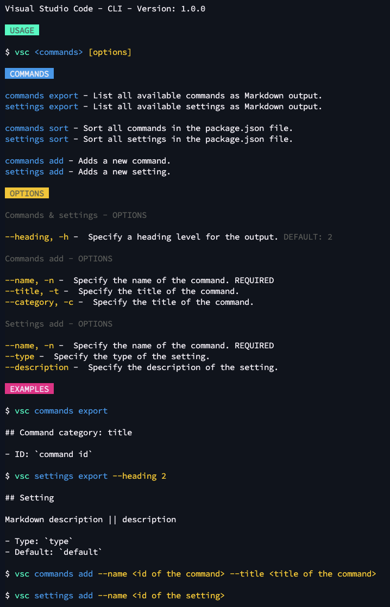

# VS Code CLI

A VS Code CLI to help you with exporting the contribution points to `Markdown`. The CLI helps you with documenting all `commands` and `settings` of your extension.



## Installation

Installation from npm

```bash
npm i -g @estruyf/vscode-cli
```

## Usage

```bash
vsc <commands> <task> [options] 
```

### Commands

- `commands`: List all available commands as Markdown output.
- `settings`: List all available settings as Markdown output.

### Tasks

- `add`: Add a new command or setting.
- `export`: Export all commands or settings.
- `sort`: Sort all commands or settings.

### Options

#### Export option(s)

- `--heading`, `-h`: Specify a heading level for the output. DEFAULT: `2`

#### Command add option(s)

- `--name`, `-n`: Specify the name of the command. REQUIRED
- `--title`, `-t`: Specify the title of the command.
- `--category`, `-c`: Specify the title of the command.

#### Setting add option(s)

- `--name`, `-n`: Specify the name of the setting. REQUIRED
- `--type`: Specify the type of the setting.
- `--description`: Specify the description of the setting.

### Examples

```bash
$ vsc commands

## Command category: title

- ID: `command id`
```

```bash
$ vsc settings --heading 2

## Setting

Markdown description || description

- Type: `type`
- Default: `default`
```

```bash
$ vsc commands add --name <id of the command> --title <title of the command> --category <category of the command>
```

```bash
$ vsc settings add --name <id of the setting>
```

## License

[MIT License](./LICENSE)

[](https://visitorbadge.io/status?path=https%3A%2F%2Fgithub.com%2Festruyf%2Fvscode-cli)