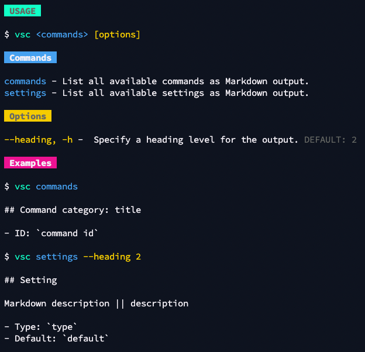

# VS Code CLI

A VS Code CLI to help you with exporting the contribution points to `Markdown`. The CLI helps you with documenting all `commands` and `settings` of your extension.



## Installation

Installation from npm

```bash
npm i -g @estruyf/vscode-cli
```

## Usage

```bash
vsc <commands> [options] 
```

### Commands

- `commands`: List all available commands as Markdown output.
- `settings`: List all available settings as Markdown output.

### Options

- `--heading`, `-h`: Specify a heading level for the output. DEFAULT: `2`

### Examples

```bash
$ vsc commands

## Command category: title

- ID: `command id`
```

```bash
$ vsc settings --heading 2

## Setting

Markdown description || description

- Type: `type`
- Default: `default`
```

## License

[MIT License](./LICENSE)

[](https://visitorbadge.io/status?path=https%3A%2F%2Fgithub.com%2Festruyf%2Fvscode-cli)